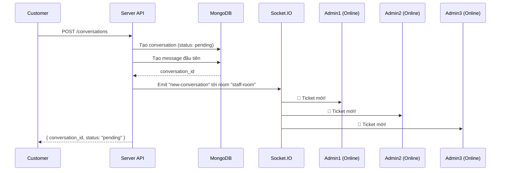
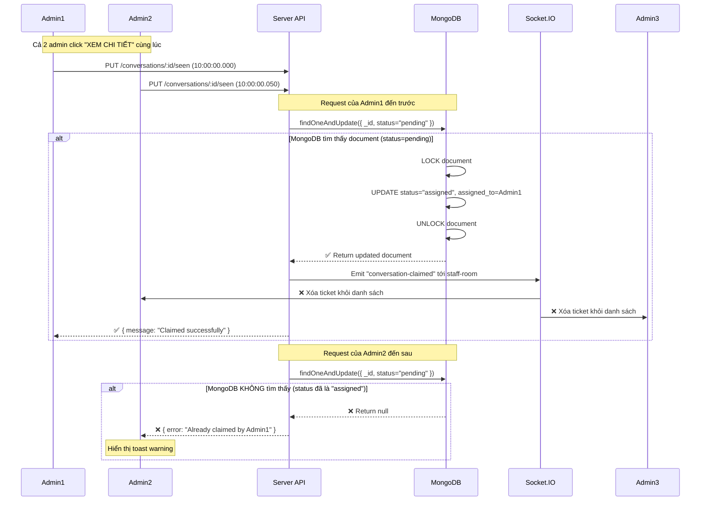
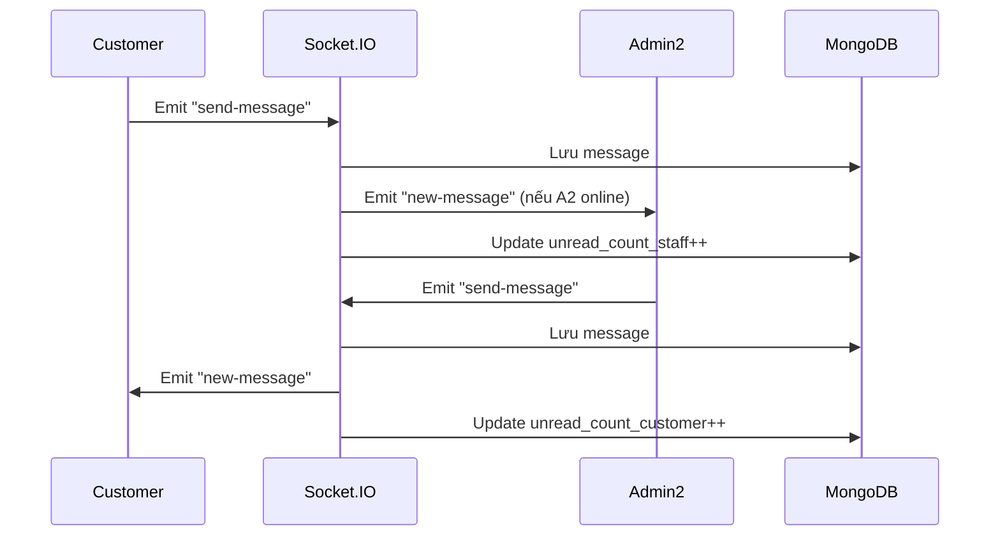

# 📚 TÀI LIỆU HỆ THỐNG CHAT THƯƠNG MẠI ĐIỆN TỬ - TICKET BASED SUPPORT

> **Mô hình:** First-Come-First-Serve với SEEN Status  
> **Nguyên lý:** Admin/Staff nào SEEN tin nhắn TRƯỚC → Người đó tiếp nhận hỗ trợ khách hàng

---

## 📋 MỤC LỤC

1. [Tổng quan hệ thống](#1-tổng-quan-hệ-thống)
2. [Cơ chế SEEN & CLAIM](#2-cơ-chế-seen--claim)
3. [Database Schema](#3-database-schema)
4. [Flow Chart - Luồng hoạt động](#4-flow-chart---luồng-hoạt-động)
5. [Implementation Code](#5-implementation-code)
6. [Socket.IO Events](#6-socketio-events)
7. [UI/UX Design](#7-uiux-design)
8. [Best Practices](#8-best-practices)

---

## 1. TỔNG QUAN HỆ THỐNG

### 🎯 **Vấn đề cần giải quyết:**

```
Tình huống:
- Có 5 Admin/Staff online cùng lúc
- Khách hàng gửi 1 tin nhắn hỗ trợ
- ❌ KHÔNG MUỐN: Khách hàng phải chọn admin cụ thể
- ✅ MUỐN: Tin nhắn gửi đến TẤT CẢ admin, ai SEEN trước → Người đó xử lý
```

### 🏗️ **Kiến trúc hệ thống:**

```
┌──────────────────────────────────────────────────────────────┐
│                    CUSTOMER (Khách hàng)                      │
│                           ⬇️                                  │
│                   Gửi tin nhắn hỗ trợ                         │
└──────────────────────────────────────────────────────────────┘
                            ⬇️
┌──────────────────────────────────────────────────────────────┐
│              CONVERSATION TICKET (Pending Status)             │
│  - status: "pending"                                          │
│  - assigned_to: null                                          │
│  - seen_by: []                                                │
└──────────────────────────────────────────────────────────────┘
                            ⬇️
        ┌───────────────────┼───────────────────┐
        ⬇️                  ⬇️                   ⬇️
    ┌────────┐         ┌────────┐          ┌────────┐
    │ Admin1 │         │ Admin2 │          │ Admin3 │
    │ ONLINE │         │ ONLINE │          │ ONLINE │
    └────────┘         └────────┘          └────────┘
        │                  │                   │
    [SEEN] ❌         [SEEN] ✅            [KHÔNG SEEN]
                          ⬇️
            ┌──────────────────────────┐
            │   Admin2 CLAIM TICKET    │
            │ - status: "assigned"     │
            │ - assigned_to: Admin2    │
            └──────────────────────────┘
                          ⬇️
        ┌──────────────────────────────────┐
        │ Ticket biến mất khỏi danh sách  │
        │ của Admin1 và Admin3             │
        └──────────────────────────────────┘
```

---

## 2. CÔ CHẾ SEEN & CLAIM

### 🔍 **Nguyên lý hoạt động:**

#### **BƯỚC 1: Khách hàng gửi tin nhắn**
```typescript
// Customer gửi message → Tạo conversation với status "pending"
{
  conversation_id: "abc123",
  customer_id: "customer_001",
  status: "pending",           // ← Chưa ai xử lý
  assigned_to: null,           // ← Chưa gán cho ai
  seen_by: [],                 // ← Chưa ai seen
  last_message: "Sản phẩm khi nào giao?",
  created_at: "2025-11-09T10:00:00Z"
}
```

#### **BƯỚC 2: Tin nhắn xuất hiện trong danh sách TẤT CẢ admin**
```
┌───────────────────── ADMIN DASHBOARD ─────────────────────┐
│  📬 PENDING TICKETS (Chưa ai xử lý)                       │
├───────────────────────────────────────────────────────────┤
│  🔔 NEW  👤 Nguyễn Văn A                                  │
│         💬 "Sản phẩm khi nào giao?"                       │
│         🕐 Vừa xong                                       │
│                                        [XEM CHI TIẾT] 👈  │
└───────────────────────────────────────────────────────────┘
```

#### **BƯỚC 3: Admin click vào "XEM CHI TIẾT" → SEEN**
```typescript
// Admin2 click vào conversation
→ API: PUT /conversations/:id/seen
→ Body: { staff_id: "admin2" }

// Server xử lý:
1. Check conversation.status === "pending" ? ✅ : ❌
2. Nếu ✅ → Update:
   {
     status: "assigned",
     assigned_to: "admin2",
     seen_by: ["admin2"],
     assigned_at: "2025-11-09T10:01:00Z"
   }
3. Emit Socket.IO → Xóa ticket khỏi danh sách admin khác
```

#### **BƯỚC 4: Admin khác không còn thấy ticket này**
```
Admin1 Dashboard:
┌───────────────────────────────────────────────────────────┐
│  📬 PENDING TICKETS (Chưa ai xử lý)                       │
├───────────────────────────────────────────────────────────┤
│  (Trống - Ticket đã được Admin2 nhận)                    │
└───────────────────────────────────────────────────────────┘

Admin2 Dashboard:
┌───────────────────────────────────────────────────────────┐
│  💼 MY TICKETS (Ticket của tôi)                           │
├───────────────────────────────────────────────────────────┤
│  ✅ ASSIGNED  👤 Nguyễn Văn A                            │
│              💬 "Sản phẩm khi nào giao?"                  │
│              🕐 1 phút trước                              │
│                                        [CHAT NGAY] 👈     │
└───────────────────────────────────────────────────────────┘
```

---

## 3. DATABASE SCHEMA

### 📦 **Collection: `conversations`**

```typescript
import { ObjectId } from "mongodb"

export enum ConversationStatus {
  PENDING = "pending",       // 🟡 Chờ admin xử lý
  ASSIGNED = "assigned",     // 🟢 Đã có admin nhận
  RESOLVED = "resolved",     // ✅ Đã giải quyết xong
  CLOSED = "closed"          // 🔒 Đã đóng
}

export interface Conversation {
  _id?: ObjectId
  
  // === THÔNG TIN CƠ BẢN ===
  customer_id: ObjectId                  // ID khách hàng
  customer_info?: {                      // Thông tin khách (cache để query nhanh)
    name: string
    email: string
    avatar?: string
    phone?: string
  }
  
  // === TRẠNG THÁI TICKET ===
  status: ConversationStatus             // Trạng thái hiện tại
  assigned_to?: ObjectId                 // ID admin/staff đang xử lý (null nếu pending)
  assigned_at?: Date                     // Thời điểm admin nhận ticket
  
  // === SEEN TRACKING (Quan trọng!) ===
  seen_by: ObjectId[]                    // Danh sách admin đã seen
  first_seen_by?: ObjectId               // Admin SEEN ĐẦU TIÊN (người claim ticket)
  first_seen_at?: Date                   // Thời gian seen đầu tiên
  
  // === THÔNG TIN TIN NHẮN ===
  subject?: string                       // Chủ đề (optional, có thể để khách tự đặt)
  last_message: string                   // Nội dung tin nhắn cuối
  last_message_at: Date                  // Thời gian tin nhắn cuối
  last_message_sender_type: "customer" | "staff"  // Ai gửi tin cuối
  
  // === UNREAD COUNT ===
  unread_count_customer: number          // Số tin chưa đọc của khách hàng
  unread_count_staff: number             // Số tin chưa đọc của staff
  
  // === METADATA ===
  priority?: "low" | "medium" | "high"   // Độ ưu tiên (VIP, đơn hàng lớn...)
  tags?: string[]                        // Tags: ["đổi trả", "giao hàng", "kỹ thuật"]
  order_id?: ObjectId                    // Liên kết với đơn hàng (nếu có)
  
  // === TIMESTAMPS ===
  created_at: Date
  updated_at: Date
  resolved_at?: Date                     // Thời gian giải quyết xong
  closed_at?: Date                       // Thời gian đóng ticket
}
```

**Index quan trọng:**
```typescript
// Tối ưu query
await databaseServices.conversation.createIndex({ status: 1, created_at: -1 })
await databaseServices.conversation.createIndex({ assigned_to: 1, status: 1 })
await databaseServices.conversation.createIndex({ customer_id: 1, status: 1 })
```

---

### 📦 **Collection: `messages`**

```typescript
export enum MessageType {
  TEXT = "text",
  IMAGE = "image",
  FILE = "file",
  SYSTEM = "system"          // Tin nhắn tự động: "Admin đã nhận ticket"
}

export interface Message {
  _id?: ObjectId
  
  // === LIÊN KẾT ===
  conversation_id: ObjectId              // ID phòng chat/ticket
  
  // === NGƯỜI GỬI ===
  sender_id: ObjectId                    // ID người gửi
  sender_type: "customer" | "staff" | "system"  // Loại người gửi
  sender_name?: string                   // Tên người gửi (cache)
  sender_avatar?: string                 // Avatar người gửi (cache)
  
  // === NỘI DUNG ===
  content: string                        // Nội dung tin nhắn
  type: MessageType                      // Loại tin nhắn
  attachments?: {                        // File đính kèm
    url: string
    filename: string
    size: number
    mimetype: string
  }[]
  
  // === SEEN STATUS (Quan trọng!) ===
  is_read: boolean                       // Đã đọc chưa
  read_by: ObjectId[]                    // Danh sách người đã đọc
  read_at?: Date                         // Thời gian đọc
  
  // === METADATA ===
  reply_to?: ObjectId                    // ID tin nhắn được reply
  edited_at?: Date                       // Thời gian chỉnh sửa
  deleted_at?: Date                      // Soft delete
  
  created_at: Date
}
```

**Index:**
```typescript
await databaseServices.message.createIndex({ conversation_id: 1, created_at: -1 })
```

---

## 4. XỬ LÝ RACE CONDITION (2 ADMIN CLICK CÙNG LÚC)

### 🔥 **VẤN ĐỀ:**

```
Tình huống:
┌──────────────────────────────────────────────────────────────┐
│  Admin A và Admin B online cùng lúc                          │
│  Cả 2 đều thấy ticket "pending" từ khách hàng Nguyễn Văn X  │
│                                                              │
│  10:00:00.000 - Admin A click "XEM CHI TIẾT" 👆             │
│  10:00:00.050 - Admin B click "XEM CHI TIẾT" 👆             │
│  10:00:00.100 - Server nhận request của Admin A             │
│  10:00:00.120 - Server nhận request của Admin B             │
│                                                              │
│  ❓ Ai sẽ được claim ticket?                                 │
└──────────────────────────────────────────────────────────────┘
```

---

### ❌ **CÁCH SAI: Tách Read & Write**

```typescript
// ❌ BAD CODE (Race Condition Bug)
async seenAndClaimConversation(conversationId, staffId) {
  // BƯỚC 1: READ
  const conversation = await databaseServices.conversation.findOne({
    _id: new ObjectId(conversationId)
  })

  // BƯỚC 2: CHECK
  if (conversation.status !== "pending") {
    throw new Error("Already claimed")
  }

  // ⚠️ NGUY HIỂM: Giữa BƯỚC 2 và BƯỚC 3 có khoảng thời gian
  // → Admin B có thể vào đây và pass qua BƯỚC 2 cùng lúc!

  // BƯỚC 3: WRITE
  await databaseServices.conversation.updateOne(
    { _id: new ObjectId(conversationId) },
    {
      $set: {
        status: "assigned",
        assigned_to: new ObjectId(staffId)
      }
    }
  )
}
```

**Timeline Bug:**
```
Time 0ms:  Admin A → findOne (status = "pending") ✅
Time 20ms: Admin B → findOne (status = "pending") ✅
Time 50ms: Admin A → Check status === "pending" ✅ (Pass)
Time 60ms: Admin B → Check status === "pending" ✅ (Pass)
Time 100ms: Admin A → updateOne (status = "assigned", assigned_to = Admin A)
Time 110ms: Admin B → updateOne (status = "assigned", assigned_to = Admin B) ⚠️ GHI ĐÈ!

KẾT QUẢ:
- Admin A nghĩ mình claim được ✅
- Admin B cũng nghĩ mình claim được ✅
- Database: assigned_to = Admin B (ghi đè Admin A)
→ Admin A bị "cướp" ticket!
```

---

### ✅ **CÁCH ĐÚNG: ATOMIC OPERATION**

```typescript
// ✅ GOOD CODE (Sử dụng findOneAndUpdate)
async seenAndClaimConversation(conversationId, staffId) {
  // ✅ Kết hợp READ + CHECK + WRITE thành 1 operation duy nhất
  const result = await databaseServices.conversation.findOneAndUpdate(
    {
      _id: new ObjectId(conversationId),
      status: ConversationStatus.PENDING // ← CHECK trong FILTER (QUAN TRỌNG!)
    },
    {
      $set: {
        status: ConversationStatus.ASSIGNED,
        assigned_to: new ObjectId(staffId),
        assigned_at: new Date()
      }
    },
    {
      returnDocument: "after" // Trả về document sau khi update
    }
  )

  // Kiểm tra kết quả
  if (!result.value) {
    // Không tìm thấy document → Ticket đã bị claim rồi
    throw new Error("Ticket đã được admin khác nhận rồi!")
  }

  return result.value
}
```

**Timeline Success:**
```
Time 0ms:  Admin A → findOneAndUpdate (filter: status="pending")
Time 20ms: Admin B → findOneAndUpdate (filter: status="pending")

MongoDB xử lý (ATOMIC):
1. Admin A request đến trước → MongoDB lock document
2. MongoDB check status === "pending" ✅
3. MongoDB update status = "assigned", assigned_to = Admin A
4. MongoDB unlock document
5. Return result.value = conversation (Admin A thành công) ✅

6. Admin B request xử lý tiếp
7. MongoDB check status === "pending" ❌ (status đã là "assigned")
8. Không tìm thấy document phù hợp filter
9. Return result.value = null (Admin B thất bại) ❌

KẾT QUẢ:
- Admin A: Claim thành công ✅
- Admin B: Nhận lỗi "Ticket đã được admin khác nhận rồi!" ❌
→ ĐÚNG!
```

---

### 🎯 **NGUYÊN LÝ HOẠT ĐỘNG:**

```
findOneAndUpdate với filter { status: "pending" } hoạt động như sau:

┌─────────────────────────────────────────────────────────────┐
│  MongoDB ATOMIC Operation (Không thể chia nhỏ)              │
├─────────────────────────────────────────────────────────────┤
│  1. LOCK document (conversation_id = "abc123")              │
│  2. CHECK: status === "pending" ?                           │
│     ├─ ✅ YES → UPDATE status = "assigned"                  │
│     │         → RETURN updated document                     │
│     └─ ❌ NO  → SKIP                                        │
│              → RETURN null                                  │
│  3. UNLOCK document                                         │
└─────────────────────────────────────────────────────────────┘

Đặc điểm:
- ⚡ ATOMIC: Toàn bộ 3 bước xảy ra trong 1 operation duy nhất
- 🔒 LOCK: Document bị lock trong quá trình xử lý
- ✅ SAFE: Chỉ 1 admin claim được, admin khác nhận null
```

---

### 📱 **XỬ LÝ UI KHI BỊ CLAIM BỞI ADMIN KHÁC:**

```typescript
// Frontend - Admin B click "XEM CHI TIẾT"
try {
  await api.put(`/conversations/${conversationId}/seen`, { staffId: adminB })
  // Thành công → Chuyển sang chat window
  navigate(`/chat/${conversationId}`)
} catch (error) {
  if (error.message.includes("đã được admin khác nhận rồi")) {
    // ⚠️ Hiển thị thông báo
    toast.warning("Ticket này đã được admin khác nhận rồi! Vui lòng chọn ticket khác.")
    
    // 🔄 Tự động xóa ticket khỏi danh sách (hoặc đợi Socket.IO emit)
    removeTicketFromList(conversationId)
  }
}
```

---

### 🔔 **SOCKET.IO REALTIME UPDATE:**

```typescript
// Server - Sau khi Admin A claim thành công
socket.on("staff:seen-conversation", async (data) => {
  try {
    const result = await conversationServices.seenAndClaimConversation(data)
    
    // ✅ Emit tới TẤT CẢ admin khác (trừ Admin A)
    socket.to("staff-room").emit("conversation-claimed", {
      conversation_id: data.conversationId,
      claimed_by: data.staffId,
      claimed_by_name: result.staff_name,
      message: `Ticket đã được ${result.staff_name} nhận`
    })

    // Trả về cho Admin A
    socket.emit("claim-success", result)
  } catch (error) {
    // ❌ Admin B nhận lỗi
    socket.emit("claim-failed", {
      conversation_id: data.conversationId,
      message: error.message
    })
  }
})

// Client - Admin B nhận event
socket.on("conversation-claimed", (data) => {
  // Xóa ticket khỏi danh sách
  removeTicketFromList(data.conversation_id)
  
  // Hiển thị toast (optional)
  toast.info(`${data.claimed_by_name} đã nhận ticket này`)
})

socket.on("claim-failed", (data) => {
  // Hiển thị lỗi
  toast.error(data.message)
})
```

---

### 🎬 **DEMO TIMELINE:**

```
10:00:00.000 - Customer gửi tin "Sản phẩm khi nào giao?"
10:00:00.010 - Server tạo conversation (status: "pending")
10:00:00.020 - Socket emit "new-conversation" → Admin A, Admin B, Admin C

10:00:05.000 - Admin A thấy ticket mới trong dashboard
10:00:05.000 - Admin B thấy ticket mới trong dashboard
10:00:05.000 - Admin C thấy ticket mới trong dashboard

10:00:10.000 - Admin A click "XEM CHI TIẾT" 👆
10:00:10.050 - Admin B click "XEM CHI TIẾT" 👆 (chậm 50ms)

10:00:10.100 - Server nhận request của Admin A
              → findOneAndUpdate (status="pending")
              → MongoDB check ✅ → UPDATE (assigned_to = Admin A)
              → Return success

10:00:10.120 - Server nhận request của Admin B
              → findOneAndUpdate (status="pending")
              → MongoDB check ❌ (status = "assigned")
              → Return null
              → Throw error "Đã được Admin A nhận rồi!"

10:00:10.150 - Socket emit "conversation-claimed" → Admin B, Admin C
              → UI tự động xóa ticket khỏi danh sách

10:00:10.200 - Admin A: Mở chat window ✅
10:00:10.200 - Admin B: Thấy toast warning ⚠️
10:00:10.200 - Admin C: Ticket biến mất khỏi danh sách 👻
```

---

## 5. FLOW CHART - LUỒNG HOẠT ĐỘNG

### 📊 **FLOW 1: Khách hàng gửi tin nhắn mới**



---

### 📊 **FLOW 2: Admin SEEN & CLAIM Ticket (Race Condition Safe)**



---

### 📊 **FLOW 3: Chat giữa Admin & Customer**



---

## 5. IMPLEMENTATION CODE

### 🔧 **File: `conversation.services.ts`**

```typescript
import databaseServices from "./database.services"
import { ObjectId } from "mongodb"
import { ConversationStatus } from "~/models/schema/conversation.schema"

class ConversationServices {
  /**
   * 1️⃣ Khách hàng tạo conversation mới
   */
  async createConversation({
    customerId,
    firstMessage,
    subject
  }: {
    customerId: string
    firstMessage: string
    subject?: string
  }) {
    // Lấy thông tin khách hàng để cache
    const customer = await databaseServices.users.findOne(
      { _id: new ObjectId(customerId) },
      {
        projection: {
          name: 1,
          email: 1,
          avatar: 1,
          numberPhone: 1
        }
      }
    )

    if (!customer) {
      throw new Error("Customer not found")
    }

    // Tạo conversation
    const conversation = await databaseServices.conversation.insertOne({
      customer_id: new ObjectId(customerId),
      customer_info: {
        name: customer.name,
        email: customer.email,
        avatar: customer.avatar,
        phone: customer.numberPhone
      },
      status: ConversationStatus.PENDING,
      assigned_to: null,
      assigned_at: null,
      seen_by: [],
      first_seen_by: null,
      first_seen_at: null,
      subject: subject || "Yêu cầu hỗ trợ",
      last_message: firstMessage,
      last_message_at: new Date(),
      last_message_sender_type: "customer",
      unread_count_customer: 0,
      unread_count_staff: 1, // Staff chưa đọc
      priority: "medium",
      tags: [],
      created_at: new Date(),
      updated_at: new Date()
    })

    const conversationId = conversation.insertedId

    // Tạo message đầu tiên
    await databaseServices.message.insertOne({
      conversation_id: conversationId,
      sender_id: new ObjectId(customerId),
      sender_type: "customer",
      sender_name: customer.name,
      sender_avatar: customer.avatar,
      content: firstMessage,
      type: "text",
      is_read: false,
      read_by: [],
      created_at: new Date()
    })

    return {
      conversation_id: conversationId.toString(),
      status: ConversationStatus.PENDING,
      message: "Conversation created successfully"
    }
  }

  /**
   * 2️⃣ Lấy danh sách PENDING tickets (Chưa ai xử lý)
   * Dành cho: TẤT CẢ admin/staff
   */
  async getPendingConversations() {
    const conversations = await databaseServices.conversation
      .aggregate([
        {
          $match: {
            status: ConversationStatus.PENDING // Chỉ lấy pending
          }
        },
        {
          $sort: {
            priority: -1, // Ưu tiên cao trước
            created_at: -1 // Tin mới trước
          }
        },
        {
          $project: {
            _id: 1,
            customer_id: 1,
            customer_info: 1,
            status: 1,
            subject: 1,
            last_message: 1,
            last_message_at: 1,
            unread_count_staff: 1,
            priority: 1,
            tags: 1,
            created_at: 1
          }
        }
      ])
      .toArray()

    return {
      conversations,
      total: conversations.length
    }
  }

  /**
   * 3️⃣ Lấy danh sách MY TICKETS (Ticket của tôi)
   * Dành cho: Staff cụ thể
   */
  async getMyConversations(staffId: string) {
    const conversations = await databaseServices.conversation
      .aggregate([
        {
          $match: {
            assigned_to: new ObjectId(staffId),
            status: { $in: [ConversationStatus.ASSIGNED, ConversationStatus.RESOLVED] }
          }
        },
        {
          $sort: {
            last_message_at: -1 // Tin mới nhất trước
          }
        },
        {
          $project: {
            _id: 1,
            customer_id: 1,
            customer_info: 1,
            status: 1,
            subject: 1,
            last_message: 1,
            last_message_at: 1,
            last_message_sender_type: 1,
            unread_count_staff: 1,
            assigned_at: 1,
            created_at: 1
          }
        }
      ])
      .toArray()

    return {
      conversations,
      total: conversations.length
    }
  }

  /**
   * 4️⃣ SEEN & CLAIM Conversation (QUAN TRỌNG NHẤT!)
   * Logic: Admin SEEN đầu tiên → Người đó nhận ticket
   * 
   * ⚠️ RACE CONDITION HANDLING:
   * Trường hợp 2 admin/nhân viên online cùng lúc click vào cùng 1 ticket
   * → Sử dụng findOneAndUpdate với filter status="pending" (ATOMIC OPERATION)
   * → Chỉ 1 admin claim được, admin kia sẽ nhận lỗi
   */
  async seenAndClaimConversation({
    conversationId,
    staffId
  }: {
    conversationId: string
    staffId: string
  }) {
    const now = new Date()

    // ✅ GIẢI PHÁP: Sử dụng findOneAndUpdate (ATOMIC OPERATION)
    // MongoDB đảm bảo chỉ 1 operation thành công
    const result = await databaseServices.conversation.findOneAndUpdate(
      {
        _id: new ObjectId(conversationId),
        status: ConversationStatus.PENDING // ← QUAN TRỌNG: Check status trong filter
      },
      {
        $set: {
          status: ConversationStatus.ASSIGNED,
          assigned_to: new ObjectId(staffId),
          assigned_at: now,
          first_seen_by: new ObjectId(staffId),
          first_seen_at: now,
          updated_at: now
        },
        $addToSet: {
          seen_by: new ObjectId(staffId)
        }
      },
      {
        returnDocument: "after" // Trả về document SAU khi update
      }
    )

    // 1. Kiểm tra kết quả
    if (!result.value) {
      // Không tìm thấy document → Có 2 khả năng:
      // a) Conversation không tồn tại
      // b) Status không phải "pending" (đã bị admin khác claim rồi)
      
      const conversation = await databaseServices.conversation.findOne({
        _id: new ObjectId(conversationId)
      })

      if (!conversation) {
        throw new Error("Conversation not found")
      }

      // Lấy thông tin admin đã claim
      const assignedStaff = await databaseServices.users.findOne(
        { _id: conversation.assigned_to },
        { projection: { name: 1 } }
      )

      throw new Error(
        `⚠️ Ticket này đã được ${assignedStaff?.name || "admin khác"} nhận rồi! Vui lòng chọn ticket khác.`
      )
    }

    // 2. Tạo system message (chỉ khi claim thành công)
    const staff = await databaseServices.users.findOne(
      { _id: new ObjectId(staffId) },
      { projection: { name: 1 } }
    )

    await databaseServices.message.insertOne({
      conversation_id: new ObjectId(conversationId),
      sender_id: new ObjectId(staffId),
      sender_type: "system",
      content: `${staff?.name || "Admin"} đã tiếp nhận yêu cầu hỗ trợ của bạn`,
      type: "system",
      is_read: false,
      read_by: [],
      created_at: now
    })

    return {
      message: "Conversation claimed successfully",
      conversation_id: conversationId,
      assigned_to: staffId,
      staff_name: staff?.name
    }
  }

  /**
   * 5️⃣ Gửi tin nhắn trong conversation
   */
  async sendMessage({
    conversationId,
    senderId,
    senderType,
    content,
    type = "text"
  }: {
    conversationId: string
    senderId: string
    senderType: "customer" | "staff"
    content: string
    type?: "text" | "image" | "file"
  }) {
    // Lấy thông tin người gửi
    const sender = await databaseServices.users.findOne(
      { _id: new ObjectId(senderId) },
      { projection: { name: 1, avatar: 1 } }
    )

    // Tạo message
    const message = await databaseServices.message.insertOne({
      conversation_id: new ObjectId(conversationId),
      sender_id: new ObjectId(senderId),
      sender_type: senderType,
      sender_name: sender?.name,
      sender_avatar: sender?.avatar,
      content,
      type,
      is_read: false,
      read_by: [],
      created_at: new Date()
    })

    // Update conversation
    const updateData: any = {
      last_message: content,
      last_message_at: new Date(),
      last_message_sender_type: senderType,
      updated_at: new Date()
    }

    if (senderType === "customer") {
      updateData.$inc = { unread_count_staff: 1 }
    } else {
      updateData.$inc = { unread_count_customer: 1 }
    }

    await databaseServices.conversation.updateOne(
      { _id: new ObjectId(conversationId) },
      updateData
    )

    return {
      message_id: message.insertedId.toString(),
      created_at: new Date()
    }
  }

  /**
   * 6️⃣ Lấy tin nhắn trong conversation (Phân trang)
   */
  async getMessages({
    conversationId,
    limit = 50,
    page = 1
  }: {
    conversationId: string
    limit?: number
    page?: number
  }) {
    const [messages, total] = await Promise.all([
      databaseServices.message
        .find({ conversation_id: new ObjectId(conversationId) })
        .sort({ created_at: -1 }) // Tin mới nhất trước
        .skip(limit * (page - 1))
        .limit(limit)
        .toArray(),

      databaseServices.message.countDocuments({
        conversation_id: new ObjectId(conversationId)
      })
    ])

    return {
      messages: messages.reverse(), // Đảo ngược để tin cũ ở trên, mới ở dưới
      total,
      page,
      limit
    }
  }

  /**
   * 7️⃣ Mark messages as read
   */
  async markAsRead({
    conversationId,
    userId,
    userType
  }: {
    conversationId: string
    userId: string
    userType: "customer" | "staff"
  }) {
    // Update tất cả tin chưa đọc
    await databaseServices.message.updateMany(
      {
        conversation_id: new ObjectId(conversationId),
        sender_type: { $ne: userType }, // Không phải tin của mình
        is_read: false
      },
      {
        $set: {
          is_read: true,
          read_at: new Date()
        },
        $addToSet: {
          read_by: new ObjectId(userId)
        }
      }
    )

    // Reset unread count
    const updateField =
      userType === "customer" ? "unread_count_customer" : "unread_count_staff"

    await databaseServices.conversation.updateOne(
      { _id: new ObjectId(conversationId) },
      {
        $set: {
          [updateField]: 0,
          updated_at: new Date()
        }
      }
    )

    return { message: "Marked as read" }
  }

  /**
   * 8️⃣ Resolve conversation (Đánh dấu đã giải quyết xong)
   */
  async resolveConversation(conversationId: string, staffId: string) {
    const conversation = await databaseServices.conversation.findOne({
      _id: new ObjectId(conversationId)
    })

    if (!conversation) {
      throw new Error("Conversation not found")
    }

    if (conversation.assigned_to?.toString() !== staffId) {
      throw new Error("You are not assigned to this conversation")
    }

    await databaseServices.conversation.updateOne(
      { _id: new ObjectId(conversationId) },
      {
        $set: {
          status: ConversationStatus.RESOLVED,
          resolved_at: new Date(),
          updated_at: new Date()
        }
      }
    )

    return { message: "Conversation resolved successfully" }
  }
}

const conversationServices = new ConversationServices()
export default conversationServices
```

---

## 6. SOCKET.IO EVENTS

### 🔌 **File: `socket.ts`**

```typescript
import { Server as SocketIOServer, Socket } from "socket.io"
import { Server as HTTPServer } from "http"
import conversationServices from "./services/conversation.services"

export const initSocket = (httpServer: HTTPServer) => {
  const io = new SocketIOServer(httpServer, {
    cors: {
      origin: process.env.CLIENT_URL,
      credentials: true
    }
  })

  // Map lưu userId → socketId
  const userSockets = new Map<string, string>()

  io.on("connection", (socket: Socket) => {
    console.log("✅ User connected:", socket.id)

    /**
     * 🔐 User đăng nhập → Join room
     */
    socket.on("user:login", (data: { userId: string; userType: "customer" | "staff" }) => {
      userSockets.set(data.userId, socket.id)
      
      if (data.userType === "staff") {
        socket.join("staff-room") // Join room chung cho tất cả staff
        console.log(`👨‍💼 Staff ${data.userId} joined staff-room`)
      } else {
        socket.join(`customer-${data.userId}`) // Join room riêng
        console.log(`👤 Customer ${data.userId} joined`)
      }
    })

    /**
     * 📨 Customer gửi tin nhắn MỚI (Tạo conversation)
     */
    socket.on(
      "customer:new-conversation",
      async (data: { customerId: string; message: string; subject?: string }) => {
        try {
          // Tạo conversation
          const result = await conversationServices.createConversation({
            customerId: data.customerId,
            firstMessage: data.message,
            subject: data.subject
          })

          // ✅ Emit tới TẤT CẢ staff online
          io.to("staff-room").emit("new-conversation", {
            conversation_id: result.conversation_id,
            customer_id: data.customerId,
            last_message: data.message,
            created_at: new Date(),
            status: "pending"
          })

          // Trả về cho customer
          socket.emit("conversation-created", result)
        } catch (error: any) {
          socket.emit("error", { message: error.message })
        }
      }
    )

    /**
     * 👀 Staff SEEN & CLAIM conversation
     */
    socket.on(
      "staff:seen-conversation",
      async (data: { conversationId: string; staffId: string }) => {
        try {
          // CLAIM conversation
          const result = await conversationServices.seenAndClaimConversation({
            conversationId: data.conversationId,
            staffId: data.staffId
          })

          // ✅ Emit tới TẤT CẢ staff khác → Xóa ticket khỏi danh sách
          socket.to("staff-room").emit("conversation-claimed", {
            conversation_id: data.conversationId,
            claimed_by: data.staffId,
            message: "Ticket này đã được admin khác nhận"
          })

          // Trả về cho staff đã claim
          socket.emit("conversation-claimed-success", result)
        } catch (error: any) {
          socket.emit("error", { message: error.message })
        }
      }
    )

    /**
     * 💬 Gửi tin nhắn trong conversation
     */
    socket.on(
      "send-message",
      async (data: {
        conversationId: string
        senderId: string
        senderType: "customer" | "staff"
        content: string
        type?: "text" | "image" | "file"
      }) => {
        try {
          // Lưu message
          const result = await conversationServices.sendMessage(data)

          // Emit tới người nhận
          if (data.senderType === "customer") {
            // Customer gửi → Emit tới staff
            const conversation = await conversationServices.getConversationById(
              data.conversationId
            )
            if (conversation.assigned_to) {
              const staffSocketId = userSockets.get(conversation.assigned_to.toString())
              if (staffSocketId) {
                io.to(staffSocketId).emit("new-message", {
                  conversation_id: data.conversationId,
                  message_id: result.message_id,
                  content: data.content,
                  sender_type: "customer",
                  created_at: result.created_at
                })
              }
            }
          } else {
            // Staff gửi → Emit tới customer
            const conversation = await conversationServices.getConversationById(
              data.conversationId
            )
            const customerId = conversation.customer_id.toString()
            const customerSocketId = userSockets.get(customerId)
            if (customerSocketId) {
              io.to(customerSocketId).emit("new-message", {
                conversation_id: data.conversationId,
                message_id: result.message_id,
                content: data.content,
                sender_type: "staff",
                created_at: result.created_at
              })
            }
          }

          socket.emit("message-sent-success", result)
        } catch (error: any) {
          socket.emit("error", { message: error.message })
        }
      }
    )

    /**
     * ✅ Mark conversation as read
     */
    socket.on(
      "mark-as-read",
      async (data: { conversationId: string; userId: string; userType: "customer" | "staff" }) => {
        try {
          await conversationServices.markAsRead(data)
          socket.emit("marked-as-read-success", { conversation_id: data.conversationId })
        } catch (error: any) {
          socket.emit("error", { message: error.message })
        }
      }
    )

    /**
     * 💬 Typing indicator
     */
    socket.on("typing", (data: { conversationId: string; userId: string; userName: string }) => {
      socket.to(`conversation-${data.conversationId}`).emit("user-typing", {
        user_id: data.userId,
        user_name: data.userName
      })
    })

    socket.on("stop-typing", (data: { conversationId: string; userId: string }) => {
      socket.to(`conversation-${data.conversationId}`).emit("user-stop-typing", {
        user_id: data.userId
      })
    })

    /**
     * 🔌 Disconnect
     */
    socket.on("disconnect", () => {
      // Xóa user khỏi map
      for (const [userId, socketId] of userSockets.entries()) {
        if (socketId === socket.id) {
          userSockets.delete(userId)
          console.log(`❌ User ${userId} disconnected`)
          break
        }
      }
    })
  })

  return io
}
```

---

## 7. UI/UX DESIGN

### 🎨 **Giao diện Admin/Staff Dashboard:**

```
┌─────────────────────────────────────────────────────────────┐
│  🏠 TECHZONE SUPPORT DASHBOARD                              │
├─────────────────────────────────────────────────────────────┤
│                                                              │
│  ┌────────────┐  ┌────────────┐  ┌────────────┐           │
│  │ 📬 PENDING │  │ 💼 MY CHAT │  │ ✅ RESOLVED│           │
│  │     3      │  │     5      │  │     12     │           │
│  └────────────┘  └────────────┘  └────────────┘           │
│                                                              │
│  ┌──────────────────────────────────────────────────────┐  │
│  │  📬 PENDING TICKETS (3)                              │  │
│  ├──────────────────────────────────────────────────────┤  │
│  │  🔔 NEW                                              │  │
│  │  👤 Nguyễn Văn A                    [XEM CHI TIẾT] │  │
│  │  💬 "Sản phẩm tôi đặt khi nào giao?"                │  │
│  │  🕐 2 phút trước                                     │  │
│  │  ────────────────────────────────────────────────   │  │
│  │  🔔 NEW                                              │  │
│  │  👤 Trần Thị B                       [XEM CHI TIẾT] │  │
│  │  💬 "Làm sao để đổi trả hàng?"                      │  │
│  │  🕐 5 phút trước                                     │  │
│  │  ────────────────────────────────────────────────   │  │
│  │  👤 Lê Văn C                         [XEM CHI TIẾT] │  │
│  │  💬 "Tôi muốn hủy đơn hàng"                         │  │
│  │  🕐 10 phút trước                                    │  │
│  └──────────────────────────────────────────────────────┘  │
│                                                              │
│  ┌──────────────────────────────────────────────────────┐  │
│  │  💼 MY TICKETS (5)                                   │  │
│  ├──────────────────────────────────────────────────────┤  │
│  │  ✅ ASSIGNED                                         │  │
│  │  👤 Phạm Minh Thuận                  [CHAT NGAY]    │  │
│  │  💬 "Cảm ơn admin!"                                  │  │
│  │  🕐 1 phút trước                     (2 tin chưa đọc)│  │
│  │  ────────────────────────────────────────────────   │  │
│  │  ✅ ASSIGNED                                         │  │
│  │  👤 Nguyễn Thị D                     [CHAT NGAY]    │  │
│  │  💬 "Admin ơi, tôi cần giúp đỡ"                     │  │
│  │  🕐 15 phút trước                                    │  │
│  └──────────────────────────────────────────────────────┘  │
└─────────────────────────────────────────────────────────────┘
```

---

### 🎨 **Giao diện Chat Window:**

```
┌─────────────────────────────────────────────────────────────┐
│  ← Quay lại          👤 Nguyễn Văn A                   [✓]  │
│                      📧 nguyenvana@gmail.com                 │
├─────────────────────────────────────────────────────────────┤
│                                                              │
│  ┌────────────────────────────────┐                        │
│  │ Nguyễn Văn A  🕐 10:00         │                        │
│  │ Sản phẩm tôi đặt khi nào giao? │                        │
│  └────────────────────────────────┘                        │
│                                                              │
│                     ┌──────────────────────────────────┐    │
│                     │ 🕐 10:01  Admin (Bạn)           │    │
│                     │ Xin chào! Cho mình xin mã đơn    │    │
│                     │ hàng để kiểm tra nhé!            │    │
│                     └──────────────────────────────────┘    │
│                                                              │
│  ┌────────────────────────────────┐                        │
│  │ Nguyễn Văn A  🕐 10:02         │                        │
│  │ Mã đơn: #123456                │                        │
│  └────────────────────────────────┘                        │
│                                                              │
│                     ┌──────────────────────────────────┐    │
│                     │ 🕐 10:03  Admin (Bạn)           │    │
│                     │ Đơn hàng sẽ được giao ngày mai   │    │
│                     │ 9h sáng nhé!                     │    │
│                     └──────────────────────────────────┘    │
│                                                              │
├─────────────────────────────────────────────────────────────┤
│  📎  😊  |  Nhập tin nhắn...                    [GỬI] ➤   │
└─────────────────────────────────────────────────────────────┘
```

---

## 8. BEST PRACTICES

### ✅ **DOs (Nên làm):**

1. **Sử dụng findOneAndUpdate ATOMIC cho CLAIM ticket:**
```typescript
// ✅ BEST PRACTICE: findOneAndUpdate với filter status="pending"
// MongoDB đảm bảo ATOMIC operation → Không cần transaction
const result = await databaseServices.conversation.findOneAndUpdate(
  {
    _id: new ObjectId(conversationId),
    status: "pending" // ← CHECK status trong FILTER (không phải trong update)
  },
  {
    $set: {
      status: "assigned",
      assigned_to: new ObjectId(staffId),
      assigned_at: new Date()
    }
  },
  { returnDocument: "after" }
)

if (!result.value) {
  // Không tìm thấy → Ticket đã bị claim rồi
  throw new Error("Already claimed by another staff")
}

// ❌ WRONG WAY: Tách ra 2 operations
const conversation = await databaseServices.conversation.findOne({ _id })
if (conversation.status === "pending") {
  // ⚠️ Race condition: 2 admin có thể pass qua đây cùng lúc!
  await databaseServices.conversation.updateOne({ _id }, { $set: { status: "assigned" } })
}
```

2. **Cache customer info để query nhanh:**
```typescript
// Lưu customer_info trong conversation → Không cần $lookup
customer_info: {
  name: "Nguyễn Văn A",
  avatar: "https://...",
  email: "email@example.com"
}
```

3. **Index database đúng cách:**
```typescript
// Tối ưu query pending tickets
await conversations.createIndex({ status: 1, created_at: -1 })

// Tối ưu query my tickets
await conversations.createIndex({ assigned_to: 1, status: 1 })
```

4. **Emit Socket.IO có target cụ thể:**
```typescript
// ✅ GOOD: Emit tới staff-room
io.to("staff-room").emit("new-conversation", data)

// ❌ BAD: Emit tới tất cả
io.emit("new-conversation", data) // Customer cũng nhận → không cần thiết
```

5. **System message khi claim:**
```typescript
// Tạo tin nhắn tự động để customer biết admin đã nhận
await databaseServices.message.insertOne({
  conversation_id: conversationId,
  sender_type: "system",
  content: "Admin Thuận đã tiếp nhận yêu cầu hỗ trợ của bạn",
  type: "system",
  created_at: new Date()
})
```

---

### ❌ **DON'Ts (Không nên làm):**

1. **Không dùng polling (setInterval) để check ticket mới:**
```typescript
// ❌ BAD: Query database liên tục
setInterval(async () => {
  const tickets = await getTickets()
}, 3000) // Tốn tài nguyên

// ✅ GOOD: Dùng Socket.IO realtime
socket.on("new-conversation", (data) => {
  // Update UI ngay lập tức
})
```

2. **Không để nhiều admin claim cùng 1 ticket:**
```typescript
// ✅ GOOD: Check status trước khi claim
if (conversation.status !== "pending") {
  throw new Error("Already claimed")
}
```

3. **Không lưu toàn bộ messages vào conversation document:**
```typescript
// ❌ BAD: Document quá lớn
{
  _id: "...",
  messages: [msg1, msg2, msg3, ...msg1000] // MongoDB document limit: 16MB
}

// ✅ GOOD: Tách ra collection riêng
conversations: { _id, customer_id, status, ... }
messages: { _id, conversation_id, content, ... }
```

---

## 9. METRICS & MONITORING (Bonus)

### 📊 **Theo dõi hiệu suất hệ thống:**

```typescript
// Thống kê số ticket mỗi staff xử lý
async getStaffPerformance(staffId: string, from: Date, to: Date) {
  const stats = await databaseServices.conversation.aggregate([
    {
      $match: {
        assigned_to: new ObjectId(staffId),
        assigned_at: { $gte: from, $lte: to }
      }
    },
    {
      $group: {
        _id: "$status",
        count: { $sum: 1 },
        avg_response_time: {
          $avg: {
            $subtract: ["$first_seen_at", "$created_at"] // Thời gian phản hồi
          }
        }
      }
    }
  ]).toArray()

  return stats
}

// Thống kê load balancing (Staff nào nhận nhiều ticket nhất)
async getLoadBalancingStats() {
  const stats = await databaseServices.conversation.aggregate([
    {
      $match: {
        status: { $in: ["assigned", "resolved"] }
      }
    },
    {
      $group: {
        _id: "$assigned_to",
        total_tickets: { $sum: 1 },
        pending_tickets: {
          $sum: { $cond: [{ $eq: ["$status", "assigned"] }, 1, 0] }
        },
        resolved_tickets: {
          $sum: { $cond: [{ $eq: ["$status", "resolved"] }, 1, 0] }
        }
      }
    },
    {
      $lookup: {
        from: "users",
        localField: "_id",
        foreignField: "_id",
        as: "staff"
      }
    },
    { $unwind: "$staff" },
    {
      $project: {
        staff_id: "$_id",
        staff_name: "$staff.name",
        total_tickets: 1,
        pending_tickets: 1,
        resolved_tickets: 1
      }
    },
    { $sort: { total_tickets: -1 } }
  ]).toArray()

  return stats
}
```

**Output:**
```json
[
  {
    "staff_id": "admin1",
    "staff_name": "Phạm Minh Thuận",
    "total_tickets": 25,
    "pending_tickets": 5,
    "resolved_tickets": 20
  },
  {
    "staff_id": "admin2",
    "staff_name": "Nguyễn Văn A",
    "total_tickets": 18,
    "pending_tickets": 3,
    "resolved_tickets": 15
  }
]
```

---

### 📈 **Dashboard Admin:**

```
┌────────────────────────────────────────────────────────────┐
│  📊 THỐNG KÊ HIỆU SUẤT                                     │
├────────────────────────────────────────────────────────────┤
│                                                             │
│  👨‍💼 Phạm Minh Thuận                                      │
│  ├─ Tổng ticket xử lý: 25                                  │
│  ├─ Đang xử lý: 5 🟡                                        │
│  ├─ Đã giải quyết: 20 ✅                                    │
│  └─ Thời gian phản hồi TB: 1.5 phút ⚡                      │
│                                                             │
│  👨‍💼 Nguyễn Văn A                                         │
│  ├─ Tổng ticket xử lý: 18                                  │
│  ├─ Đang xử lý: 3 🟡                                        │
│  ├─ Đã giải quyết: 15 ✅                                    │
│  └─ Thời gian phản hồi TB: 2.3 phút                        │
│                                                             │
│  📉 RACE CONDITION STATS (24h qua):                        │
│  ├─ Tổng ticket mới: 150                                   │
│  ├─ Claim thành công: 150 ✅                                │
│  ├─ Claim thất bại (đụng độ): 23 ⚠️                        │
│  └─ Tỷ lệ conflict: 15.3%                                  │
│                                                             │
└────────────────────────────────────────────────────────────┘
```

---

### 🔔 **Alert System:**

```typescript
// Cảnh báo khi có quá nhiều pending tickets
async checkPendingTicketsAlert() {
  const pendingCount = await databaseServices.conversation.countDocuments({
    status: "pending"
  })

  if (pendingCount > 10) {
    // Gửi thông báo tới Slack/Email
    await sendAlert({
      type: "warning",
      message: `⚠️ Có ${pendingCount} ticket đang chờ xử lý!`,
      action: "Cần thêm nhân viên online"
    })
  }
}

// Cảnh báo khi staff quá tải
async checkStaffOverloadAlert() {
  const overloadedStaff = await databaseServices.conversation.aggregate([
    {
      $match: { status: "assigned" }
    },
    {
      $group: {
        _id: "$assigned_to",
        count: { $sum: 1 }
      }
    },
    {
      $match: { count: { $gt: 10 } } // Quá 10 ticket cùng lúc
    }
  ]).toArray()

  if (overloadedStaff.length > 0) {
    await sendAlert({
      type: "warning",
      message: `⚠️ ${overloadedStaff.length} nhân viên đang xử lý quá nhiều ticket!`,
      action: "Cần phân phối lại hoặc thêm nhân viên"
    })
  }
}
```

---

## 🎯 KẾT LUẬN

### **Tóm tắt cơ chế SEEN & CLAIM:**

1. **Khách hàng gửi tin** → Tạo conversation với `status: "pending"`
2. **Tin nhắn xuất hiện** trong danh sách TẤT CẢ admin/staff online
3. **Admin/Staff click "XEM CHI TIẾT"** → Gọi API `PUT /conversations/:id/seen`
4. **Server check** `status === "pending"` → Nếu ✅ → UPDATE `status: "assigned", assigned_to: staffId`
5. **Socket.IO emit** → Xóa ticket khỏi danh sách admin khác
6. **Ticket chuyển sang "MY TICKETS"** của admin đã SEEN

### **Ưu điểm:**

✅ **Fair** - Ai SEEN trước người đó xử lý  
✅ **Realtime** - Socket.IO cập nhật ngay lập tức  
✅ **Scalable** - Dễ mở rộng nhiều admin  
✅ **No conflict** - Chỉ 1 admin claim được ticket (ATOMIC operation)  
✅ **Race condition safe** - Xử lý đúng khi 2+ admin click cùng lúc  
✅ **Load balancing** - Phân phối đồng đều ticket  

---

### **🔥 Điểm mạnh chính:**

1. **ATOMIC Operation** - Sử dụng `findOneAndUpdate` với filter `status="pending"` → MongoDB đảm bảo chỉ 1 admin claim được ticket, tránh race condition
2. **Socket.IO Realtime** - Ticket biến mất ngay lập tức khỏi danh sách admin khác khi đã được claim
3. **User Experience** - Admin nhận thông báo rõ ràng nếu ticket đã được claim bởi người khác
4. **Metrics & Monitoring** - Theo dõi hiệu suất, phát hiện overload, alert tự động

---

### **� TL;DR - Tóm tắt nhanh:**

```
❓ VẤN ĐỀ: 2 admin online cùng lúc, ai được claim ticket?

✅ GIẢI PHÁP:
1. Dùng findOneAndUpdate với filter { status: "pending" }
2. MongoDB ATOMIC operation → Chỉ 1 admin thành công
3. Socket.IO emit → Admin khác nhận thông báo và xóa ticket
4. UX tốt: Toast warning "Ticket đã được admin khác nhận rồi!"

📊 KẾT QUẢ:
- Admin A click trước → Claim thành công ✅
- Admin B click sau 50ms → Nhận lỗi ❌
- Không có duplicate claim
- Không cần transaction phức tạp
```

---

**�📝 Lưu ý:** Đây là tài liệu chi tiết cho hệ thống chat thương mại điện tử với xử lý race condition an toàn. Bạn có thể tùy chỉnh theo nhu cầu cụ thể của dự án!

**🔗 Các file cần implement:**
- `src/models/schema/conversation.schema.ts` - Schema conversation & message
- `src/services/conversation.services.ts` - Business logic (8 functions)
- `src/controllers/conversation.controllers.ts` - API endpoints
- `src/routes/conversation.routes.ts` - Routes
- `socket.ts` - Socket.IO events (7 events chính)

**🚀 Next Steps:**
1. Tạo schema MongoDB theo document này
2. Implement services với `findOneAndUpdate` (ATOMIC)
3. Setup Socket.IO events
4. Test race condition (2 admin click cùng lúc)
5. Implement UI dashboard & chat window

